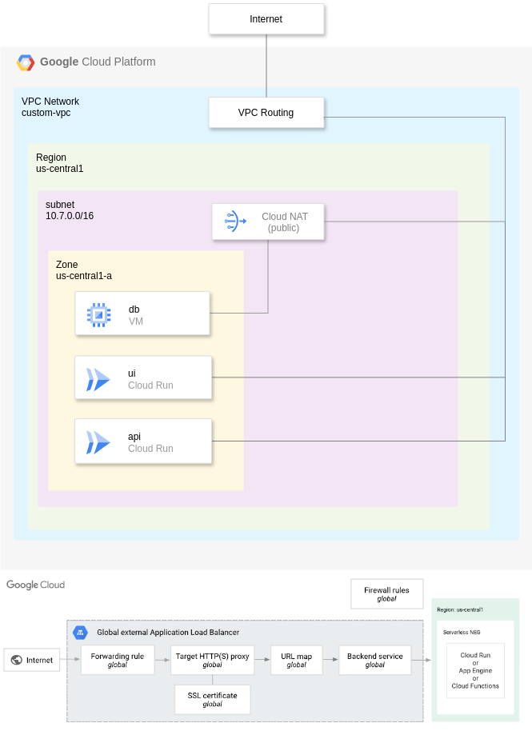

# Consignar.pt Infra Managed With Terraform

[API REST](https://rest.consignar.pt)  
[WEB](https://consignar.pt)  
[WEB 2.0](https://web.consignar.pt)  
[WEB 3.0](https://www.consignar.pt)  

## Deployed Infrastructure

## Costs By Infracost

Note: some units are not correct (real prod costs: 30$)

Project: main-prod

 Name                                                                   Monthly Qty  Unit          Monthly Cost    
                                                                                                                   
 module.network.google_compute_global_forwarding_rule.default                                                      
 ├─ Forwarding rules                                                            730  hours                $7.30    
 └─ Ingress data                                                                625  GB                   $5.00  * 
                                                                                                                   
 module.network.google_compute_global_forwarding_rule.https_redirect                                               
 ├─ Forwarding rules                                                            730  hours                $7.30    
 └─ Ingress data                                                                625  GB                   $5.00  * 
                                                                                                                   
 module.network.google_compute_router_nat.nat                                                                      
 ├─ Assigned VMs (first 32)                                                   2,920  VM-hours             $4.09  *   
 └─ Data processed                                                              111  GB                   $5.00  * 
                                                                                                                   
 module.network.google_compute_global_address.default                                                              
 └─ IP address                                                                  730  hours                $0.00    
                                                                                                                   
 module.compute_engine.google_compute_instance.this                                                                
 ├─ Instance usage (Linux/UNIX, on-demand, e2-micro)                            730  hours                $0.00 (Free Tier)   
 └─ Standard provisioned storage (pd-standard)                                   10  GB                   $0.00 (Free Tier)     
                                                                                                                   
 module.cloud_build.google_secret_manager_secret.github-secret                                                     
 ├─ Active secret versions                                                       83  versions             $4.98  *   
 ├─ Access operations                                                         0.005  10K requests         $0.00  *   
 └─ Rotation notifications                                                        1  rotations            $0.05  * 
                                                                                                                   
 module.network.google_compute_target_http_proxy.https_redirect                                                    
 └─ Data processed                                                              625  GB                   $5.00  * 
                                                                                                                   
 module.network.google_compute_target_https_proxy.default                                                          
 └─ Data processed                                                              625  GB                   $5.00  * 
                                                                                                                   
 module.repository.google_artifact_registry_repository.this                                                        
 └─ Storage                                                                      50  GB                   $5.00  * 
                                                                                                                   
 module.cloud_build.google_secret_manager_secret_version.github-secret                                             
 ├─ Active secret versions                                                        1  versions             $0.06    
 └─ Access operations                                                         0.005  10K requests         $0.00  * 
                                                                                                                   

*Usage costs were estimated using Infracost Cloud settings

36 cloud resources were detected:  
∙ 10 were estimated  
∙ 19 were free  
∙ 7 are not supported yet  

Baseline cost $28   
Usage cost $39  
 
<!-- BEGIN_TF_DOCS -->
## Requirements

| Name | Version |
|------|---------|
|  [google](#requirement\_google) | 5.29.1 |

## Providers

No providers.

## Modules

| Name | Source | Version |
|------|--------|---------|
|  [cloud\_build](#module\_cloud\_build) | ./modules/cloud_build | 0.1.2 |
|  [cloud\_run](#module\_cloud\_run) | ./modules/cloud_run | 0.1.1 |
|  [compute\_engine](#module\_compute\_engine) | ./modules/compute_engine | 0.3.2 |
|  [network](#module\_network) | ./modules/network | 0.2.1 |
|  [repository](#module\_repository) | ./modules/repository | 0.0.1 |

## Resources

No resources.

## Inputs

| Name | Description | Type | Default | Required |
|------|-------------|------|---------|:--------:|
|  [consignar\_certificate\_path](#input\_consignar\_certificate\_path) | Consignar Certificate Path | `string` | n/a | yes |
|  [consignar\_domain](#input\_consignar\_domain) | Consignar Main Domain | `string` | `"consignar.pt"` | no |
|  [consignar\_private\_key\_path](#input\_consignar\_private\_key\_path) | Consignar Private Key Path | `string` | n/a | yes |
|  [consignar\_rest\_domain](#input\_consignar\_rest\_domain) | Consignar REST Domain | `string` | `"rest.consignar.pt"` | no |
|  [consignar\_web\_domain](#input\_consignar\_web\_domain) | Consignar Web Domain | `string` | `"web.consignar.pt"` | no |
|  [db\_password](#input\_db\_password) | Database Password | `string` | n/a | yes |
|  [github\_app\_installation\_id](#input\_github\_app\_installation\_id) | GitHub App installation id | `number` | n/a | yes |
|  [github\_client\_secret\_data](#input\_github\_client\_secret\_data) | GitHub Client Secret Data | `any` | n/a | yes |
|  [github\_repository\_uri](#input\_github\_repository\_uri) | GitHub Repository URI | `string` | n/a | yes |
|  [ip\_cidr\_range](#input\_ip\_cidr\_range) | IP Range | `string` | `"10.7.0.0/16"` | no |
|  [irs\_api\_name](#input\_irs\_api\_name) | Consignar REST API Image Name | `string` | `"irs-api-internal"` | no |
|  [irs\_api\_port](#input\_irs\_api\_port) | Port number the IRS API listens on | `number` | `50007` | no |
|  [irs\_ui\_name](#input\_irs\_ui\_name) | Consignar Image Name | `string` | `"irs-ui-internal"` | no |
|  [irs\_ui\_port](#input\_irs\_ui\_port) | Port number the IRS UI listens on | `number` | `8080` | no |
|  [machine\_type](#input\_machine\_type) | DB Machine Type | `string` | `"e2-micro"` | no |
|  [project\_name](#input\_project\_name) | Name of the project | `string` | n/a | yes |
|  [project\_number](#input\_project\_number) | Project Number | `number` | n/a | yes |
|  [region](#input\_region) | Deploy region | `string` | `"us-central1"` | no |
|  [repository\_id](#input\_repository\_id) | Repository ID | `string` | n/a | yes |
|  [zone](#input\_zone) | Deploy Zone | `string` | `"us-central1-a"` | no |

## Outputs

| Name | Description |
|------|-------------|
|  [db\_internal\_ip](#output\_db\_internal\_ip) | The internal IP of the database instance |
<!-- END_TF_DOCS -->
